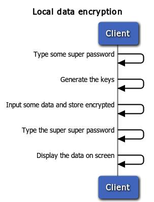
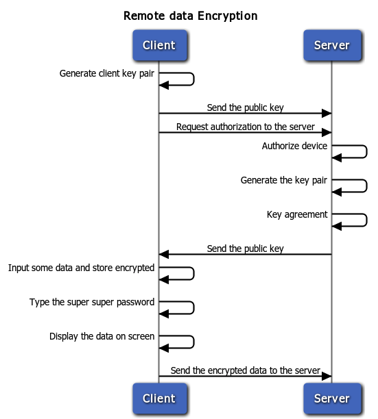
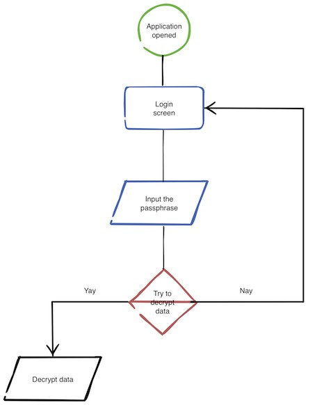

# Status: Experimental

# AeroGear Crypto API

**Note**: This document is a working progress if you strongly disagree with something, fix it.

# Authors

* Bruno Oliveira
* Douglas Campos
* Matthias Wessendorf
* *put your pretty name here* 

# Goals

* User friendly interface for non crypto experts
* Advanced developers can make use of the pure crypto provider implementation.

# Supported Algorithms

* https://issues.jboss.org/browse/AGSEC-114

# Scenarios

**Note**: For all scenarios the authentication process was intentionally ignored. 

## Local data encryption (priority 1)

* An user wants to store sensitive data on mobile device and the data must be protected

For this scenario we will make use of *symmetric ciphers* to encrypt/decrypt the local data, of course an efficient way to properly store the key must be evaluated and the key should never be shared with others. 

The API *can't* encourage developers to commit some common mistakes like predictable key, IV or salt, that said the API must be responsible for the entropy behind the scenes and as well generate these values. 

By default the API will provide *AES* with *GCM*, if for some reason the crypto provider doesn't have any support for these modes, *CBC* or *CTR*  must be replacement and the change explicitly documented.

**Note**: The following solution doesn't prevent an attacker from extract the data via USB and try to break the encryption. 

## asymmetric encryption - Key agreement (priority 2)

* The data must be backed up on the server, but passwords can't be exposed

* The application was installed into another device and the keys must be revoked on the server

[Under development]

* User wants to configure for how long the keys will be considered valid 

[Under development]

* Device was stolen and data must be destroyed  

[Under development]

# JavaScript

## Dependencies

* [sjcl](http://crypto.stanford.edu/sjcl/) with wrappers for basic functionalities like: encrypt, decrypt, password salting and key pair generation. 

## Implementation details

* The size of sjcl library is still a concern (28K)
    
* Crypto bits were built in a separate module so it may be included/excluded in a custom build.

* The project will be developed under AeroGear.js repository (https://github.com/aerogear/aerogear-js/pull/57)

## API (draft 0)

* Password based key derivation support (PBKDF2)

        myEncryptedPassword = AeroGear.password("strong");

* Symmetric encryption support (GCM)

    * Encryption:

            var options = {
                IV: superRandomInitializationVector,
                AAD: "whateverAuthenticatedData",
                key: generatedKey,
                data: "My bonnie lies over the ocean"
            };
            
            var cipherText = AeroGear.encrypt( options );

    * Decryption:

            var options = {
                IV: superRandomInitializationVector,
                AAD: "whateverAuthenticatedData",
                key: generatedKey,
                data: cipherText
            };
            AeroGear.decrypt( options );
            

* Message authentication support (GMAC, HMAC)

[Under development]

**Note**: The implementations below are currently under discussion at https://github.com/aerogear/aerogear-js/pull/62

* Hashing support (SHA-256, SHA-512)

        digest = AeroGear.crypto.hash("some message");
 
* Asymmetric encryption support (ECC)

        var hex = sjcl.codec.hex,
            keyPair = new AeroGear.crypto.KeyPair(),
            cipherText, plainText,
            options = {
                IV: superRandomInitializationVector,
                AAD: "whateverAuthenticatedData",
                key: keyPair.publicKey,
                data: ""My bonnie lies over the ocean"
            };
        cipherText = AeroGear.crypto.encrypt( options );
        options.key = keyPair.privateKey;
        options.data = cipherText;
        plainText = AeroGear.crypto.decrypt( options );

* Digital signatures support (ECDSA)

        var validation,
            options = {
                keys: sjcl.ecc.ecdsa.generateKeys(192),
                message: "My bonnie lies over the ocean"
            };
        options.signature = AeroGear.crypto.sign( options );
        validation = AeroGear.crypto.verify( options );

# Android

## Dependencies

* [Spongy Castle](http://rtyley.github.io/spongycastle/) with wrappers for basic functionalities like: encrypt, decrypt, password salting and key pair generation. 

## Implementation details

* The bouncycastle "provided" in Android doesn't have ECDH that's the reason why Spongy Castle was chosen.
    
* aerogear-crypto-java will be the main repository to provide a crypto API for Android and the Java server.

## API (draft 0)

**Note**: The implementations below are currently under discussion at https://github.com/aerogear/aerogear-crypto-java/tree/refactoring

* Password based key derivation support (PBKDF2)

        Pbkdf2 pbkdf2 = AeroGearCrypto.pbkdf2();
        byte[] rawPassword = pbkdf2.encrypt(PASSWORD);

* Symmetric encryption support (GCM)

    * Encryption:

            CryptoBox cryptoBox = new CryptoBox(new PrivateKey(SOME_SECRET_KEY));
            final byte[] IV = new Random().randomBytes(); 
            final byte[] message = "My bonnie lies over the ocean".getBytes();
            final byte[] ciphertext = cryptoBox.encrypt(IV, message);

    * Decryption:

            CryptoBox pandora = new CryptoBox(new PrivateKey(SOME_SECRET_KEY));
            final byte[] message = pandora.decrypt(IV, ciphertext);
            

* Message authentication support (GMAC, HMAC)

[Under development]

* Hashing support (SHA-256, SHA-512)

[Under development]
 
* Asymmetric encryption support (ECC)

        KeyPair keyPair = new KeyPair();
        KeyPair keyPairPandora = new KeyPair();

        CryptoBox cryptoBox = new CryptoBox(keyPair.getPrivateKey(), keyPairPandora.getPublicKey());
        final byte[] IV = new Random().randomBytes();
        final byte[] message = "My bonnie lies over the ocean".getBytes();
        final byte[] ciphertext = cryptoBox.encrypt(IV, message);

        CryptoBox pandora = new CryptoBox(keyPairPandora.getPrivateKey(), keyPair.getPublicKey());
        final byte[] message = pandora.decrypt(IV, ciphertext);

* Digital signatures support (ECDSA)

[Under development]

# iOS

## Meetings

* 08/10/2013 check the ([agenda](http://oksoclap.com/p/iOS_Meeting_(Security))) on [IRC](http://transcripts.jboss.org/meeting/irc.freenode.org/aerogear/2013/aerogear.2013-10-08-13.55.log.html).

* 11/10/2013 check the ([agenda](http://oksoclap.com/p/iOS_Security_Notes_11.10.13)) on [IRC](http://transcripts.jboss.org/meeting/irc.freenode.org/aerogear/2013/aerogear.2013-10-11-11.11.log.html).

## Dependencies

The following frameworks and libraries are part of the iOS platform:

* [Common Crypto](https://developer.apple.com/library/mac/documentation/security/conceptual/cryptoservices/GeneralPurposeCrypto/GeneralPurposeCrypto.html)
* [Security Framework](https://developer.apple.com/library/ios/documentation/Security/Reference/SecurityFrameworkReference/_index.html)

## Implementation details

Plan:

 * build AeroGear wrappers around the above dependencies
 * build the wrappers in an OO-style (in ObjC)
 * evaluate JS/Android API for an easy to use interface (to have it similar to existing APIs, since it would be odd if the iOS library looks totally different)

## API (draft 0)

* Password based key derivation support (PBKDF2)

[Under development]

* Symmetric encryption support (GCM)

**NOTE:** AES GCM Mode is supported by CommonCrypto but it's currently part of a [private interface](https://github.com/Apple-FOSS-Mirror/CommonCrypto/blob/master/Source/CommonCryptoSPI/CommonCryptorSPI.h#L71) so makes it unavailable to use. We start first with exposing Mode AES CBC which is [supported](https://gist.github.com/cvasilak/b967893655a04cbe5b7b#file-gistfile1-txt-L669).

[Under development]

* Message authentication support (GMAC, HMAC)

[Under development]

* Hashing support (SHA-256, SHA-512)

[Under development]
 
* Asymmetric encryption support (ECC);
 
**NOTE:** ECC is supported by CommonCrypto but it's currently part of a [private interface](https://github.com/Apple-FOSS-Mirror/CommonCrypto/blob/master/Source/CommonCryptoSPI/CommonECCryptor.h) so makes it unavailable to use. We will stick with RSA with Diffie Hellman for it.

[Under development]

* Digital signatures support (ECDSA)

[Under development]

# Demo application workflow

